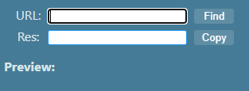
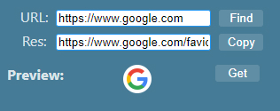

# Get Site Favicon

> Chromium extension, Firefox Add-on

You can get the favicon for the site by entering a URL.

## Appearance

- 

- 

## Dependence

- [akanshgulati/scrap-favicon](https://github.com/akanshgulati/scrap-favicon) ([MIT license](https://github.com/akanshgulati/scrap-favicon/blob/master/LICENSE))
- [zenorocha/clipboard.js](https://github.com/zenorocha/clipboard.js) ([MIT license](https://github.com/zenorocha/clipboard.js/blob/master/LICENSE))

## License

[GPL-3.0](./LICENSE) license
